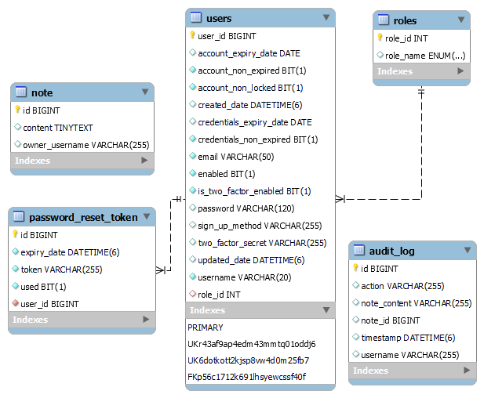

# Secure Notes WebApplication using SpringBoot and Spring Security 6

### EER DIAGRAM

--
### CSRF -> `Cross-Site Request Forgery`
#### type of malicious exploit of a website where unauthorized commands are transmitted on behalf user, where a third-party site is making a request.

--------
### JWT Authentication -> `JSON Web Token Authentication`
- #### [*encode/decode jwt*](https://jwt.io/)
- #### [*jwt maven dependencies*](https://github.com/jwtk/jjwt)
----

<!-- - #### without jwt
  - no expiration time, 
  - can be decoded easily  
- #### without jwt
  - Hi
  - Hi
  - Hi
  - Hi -->

  ### Multi-Factor Authentication (MFA)
  - #### using Google authenticator

