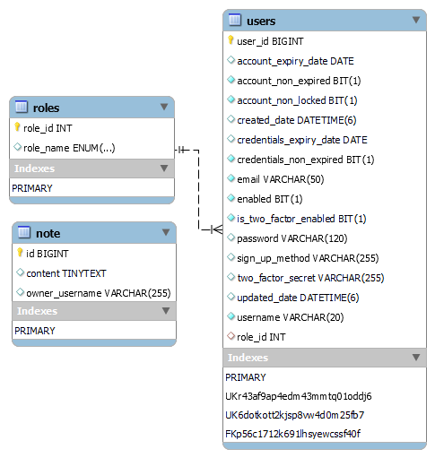

# Secure Notes WebApplication using SpringBoot and Spring Secuirty Secuity 6

### EER DIAGRAM

--
### CSRF -> `Cross-Site Request Forgery`
#### type of malicious exploit of a website where unauthorized commands are transmitted on the behalf user, where a third party site is making a request.

---
### JWT Authentication -> `JSON Web Token Authentication` #### [*encode/decode jwt*](https://jwt.io/)
----
<!-- - #### without jwt
  - no expiration time, 
  - can be decoded easily  
- #### without jwt
  - Hi
  - Hi
  - Hi
  - Hi -->
